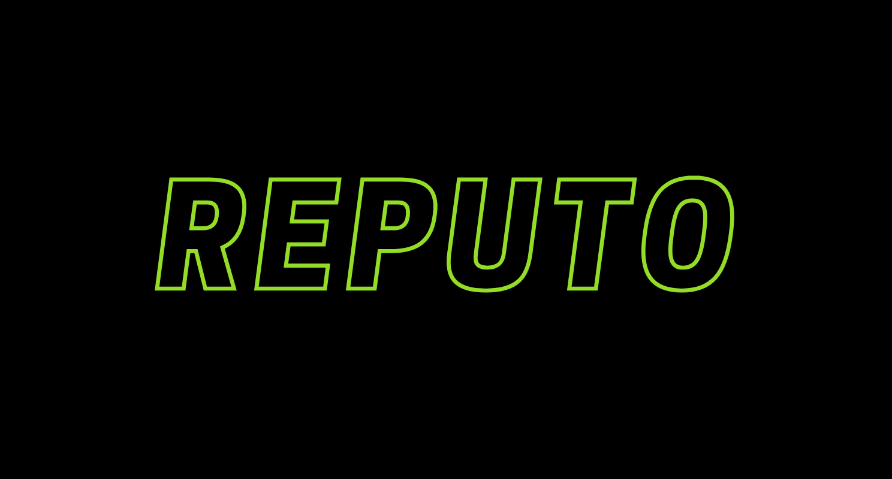

<p align="center">
  <a href="https://logid.xyz">Reputo</a> is a privacy-preserving reputation platform with three main surfaces: a NestJS API, a Next.js UI, and Temporal-based workers that orchestrate snapshot execution and algorithm runs.
  <br/>
  This repository is the pnpm monorepo for those apps and the shared packages they build on.
</p>

<div align="center">

[](https://github.com/reputo-org/reputo/actions/workflows/main.yml)&nbsp;[](https://codecov.io/gh/reputo-org/reputo)&nbsp;[](LICENSE)

</div>


## App & API References

| Surface | URL |
| --- | --- |
| App | [staging.logid.xyz](https://staging.logid.xyz) 
| API Reference | [api-staging.logid.xyz/reference](https://api-staging.logid.xyz/reference) 

## Getting Started

Use Node 20+ with `pnpm@10.30.3`.

### Local

```bash
pnpm install
pnpm dev
```

### Docker

```bash
docker compose -f docker/compose/dev.yml up --build
```

This is the hot-reload local testing stack. The UI is routed at `http://localhost`, the API at `http://localhost/api`, Temporal UI at `http://localhost:8088`, and Grafana at `http://localhost:3001`.

See [docker/README.md](docker/README.md).

### Checks

```bash
pnpm build
pnpm check
pnpm test
```

## Monorepo Overview

### Apps

| Workspace | Purpose | Docs |
| --- | --- | --- |
| `@reputo/api` | NestJS HTTP API for algorithm presets, snapshots, storage, and health/docs endpoints. | [README](apps/api/README.md) |
| `@reputo/ui` | Next.js dashboard for browsing algorithms, creating presets, launching snapshots, and tracking execution. | [README](apps/ui/README.md) |
| `@reputo/workflows` | Temporal workers for orchestration, TypeScript algorithm execution, and on-chain data tasks. | [README](apps/workflows/README.md) |

### Packages

| Workspace | Purpose | Docs |
| --- | --- | --- |
| `@reputo/reputation-algorithms` | Versioned algorithm registry and discovery library. | [README](packages/reputation-algorithms/README.md) |
| `@reputo/algorithm-validator` | Shared Zod validation for algorithm payloads and CSV content. | [README](packages/algorithm-validator/README.md) |
| `@reputo/database` | Shared Mongoose connection utilities, schemas, and model exports. | [README](packages/database/README.md) |
| `@reputo/storage` | Shared S3 storage abstraction and presigned URL helpers. | [README](packages/storage/README.md) |
| `@reputo/onchain-data` | Token transfer sync pipeline backed by PostgreSQL. | [README](packages/onchain-data/README.md) |
| `@reputo/deepfunding-portal-api` | DeepFunding Portal API client and SQLite ingest utilities. | [README](packages/deepfunding-portal-api/README.md) |

## Environments

- Preview deployments are created for pull requests that carry the `pullpreview` label. They publish only `preview-<commit>` image tags.
- Main branch builds publish immutable `sha-<commit>` images for affected apps and update the mutable `staging` tag for those same apps.
- Production promotion is manual and digest-based: it resolves the digest behind `sha-<commit>` and updates only the affected apps to the `production` channel tag.

### Environment Files

Tracked files under `docker/env/examples/*.env.example` are the only canonical environment templates. Copy them into `docker/env/*.env` locally before using the Docker stacks.

For operational details, image flow, and local infrastructure setup, see [docker/README.md](docker/README.md).

## Algorithm Development

Algorithms combine a versioned definition in `packages/reputation-algorithms` with execution logic in `apps/workflows`.

```bash
pnpm algorithm:create <key> <version>
pnpm algorithm:validate
```


## Contributing

### Branching Strategy: GitHub Flow

1. **Create feature branch** from `main`

    ```bash
    git checkout -b feature/your-feature-name
    ```

2. **Open Pull Request** to `main`
    - Add `pullpreview` label for preview deployment
    - Ensure CI passes
    - Request review from maintainers


## License

Released under the **GPL-3.0** license. See [LICENSE](LICENSE).
